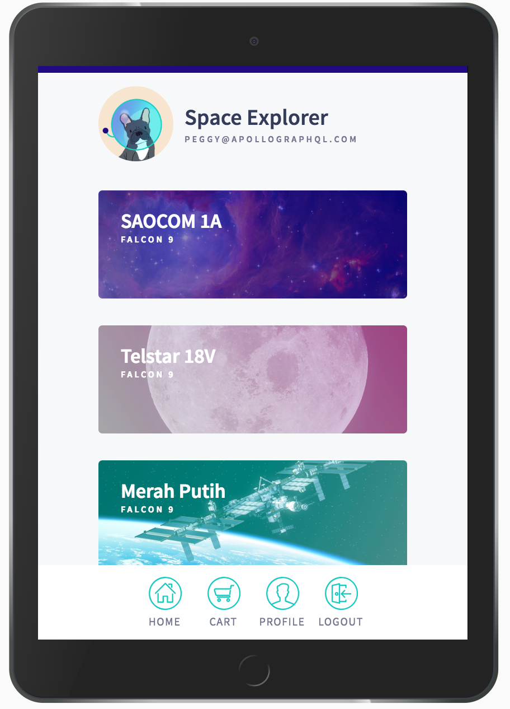

## Some more infromation

Return to `src/index.js` and add the following call to the bottom of the file:

```js:title=src/index.js
server.listen().then(() => {
  console.log(`
    Server is running!
    Listening on port 4000
    Explore at https://studio.apollographql.com/sandbox
  `);
});
```

