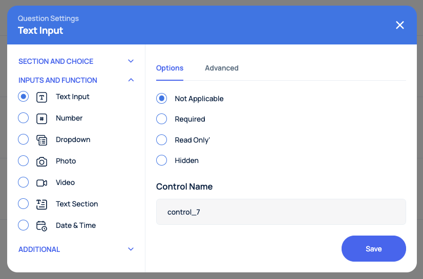

RoxForms has extensive list of controls users can use in their forms. All controls have basic settings like state and name, but also each control might have advance settings like **Speech to Text** for text controls. Here is a list of available controls:
* [Date Time](https://docs.roxabo.com/controls/cntrl-datetime)
* [Attachment](https://docs.roxabo.com/controls/cntrl-attachment)
* [Electronic Signature](https://docs.roxabo.com/controls/cntrl-electronic-signature)
* [Location](https://docs.roxabo.com/controls/cntrl-location)
* [Multiple Choice](https://docs.roxabo.com/controls/cntrl-multiple-choice)
* [Single Choice](https://docs.roxabo.com/controls/cntrl-single-choice)
* [Text Input](https://docs.roxabo.com/controls/cntrl-text-input)
* [Number Input](https://docs.roxabo.com/controls/cntrl-number)
* [Page Break](https://docs.roxabo.com/controls/cntrl-page-break)
* [Photo](https://docs.roxabo.com/controls/cntrl-photo)
* [Video](https://docs.roxabo.com/controls/cntrl-video)
* [Section](https://docs.roxabo.com/controls/cntrl-section)
* [Table](https://docs.roxabo.com/controls/cntrl-table)

## Options
Every control in RoxForms has a default **Options** section:


All controls have a **state** parameter, which can have values:
* Not Applicabale
* Required
* Read Only
* Hidden

When using [WebHook Integration](https://docs.roxabo.com/integration/int-webhooks/), all controls will pass their current state, and by using your custom workflow you can manipulate the control's state - hide or show depending on the workflow requirements:
```jsx
    POST https://{customerwebhook.com}
    {
    "data": {
        "formId": {
        "state": "hidden",
        "value": ""
        },
        "control_1": {
        "state": "notApplicable",
        "value": {
            "key": "ZEw2jkoWqhQQrOIQKlsu",
            "label": "Admin Digital"
        }
        },
        "control_4": {
        "state": "notApplicable",
        "value": {
            "label": "NIck Savenko 2",
            "value": "U4JMLVNGGdEkYFNeLBEJ"
        }
        }
    },
    "action": "Update"
    }
```

## Control Names
In addition, every control has a name. The name has to be unique for each control as RoxForms uses control names in Workflow and Export functions, but also in [SQL DB Integration](https://docs.roxabo.com/integration/int-database)


