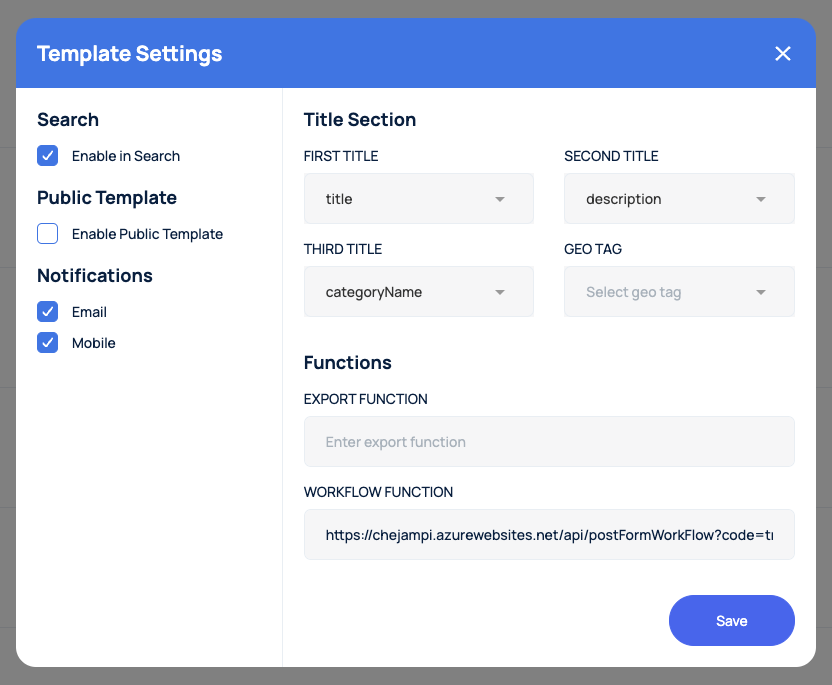

RoxForms is a modern event driven platform. Every change to the forms and templates will be exposed through web hooks. Customers can integrate event feeds into their login or workflow systems.
> RoxForms has two types of webhooks - **two-way** and **one-way** web hooks. One-way web hooks commonly used for extenral loging. Events are trasmitted from the RoxForms to the custom URL and RoxForms is not expecting a response back.
**Two-way** web hooks are commonly used for Workflow and PDF extenral functions. By using **two-way** web hooks, users can change objects in RoxForms (change control states, populate fields, generate custom PDFs).

## Workflow Function

Each RoxForms temaplte has settings screen:



If **Workflow Function** field has value and every time form is submitted a custom function will be called and form object will be passed to it:

```jsx
    POST https://{customerwebhook.com}
    {
    "assignedAt": null,
    "assignedTo": [],
    "canBeDeleted": true,
    "canBeSubmitted": true,
    "categoryId": "As9xMGjoAbKGfrazNEFI",
    "categoryName": "Safety",
    "createdAt": "2021-09-02T23:08:56.366Z",
    "createdBy": "UtSQFBhvs6gPYJsFVGAc",
    "data": {
        "formId": {
        "state": "hidden",
        "value": ""
        },
        "control_1": {
        "state": "notApplicable",
        "value": {
            "key": "ZEw2jkoWqhQQrOIQKlsu",
            "label": "Admin Digital"
        }
        },
        "control_4": {
        "state": "notApplicable",
        "value": {
            "label": "NIck Savenko 2",
            "value": "U4JMLVNGGdEkYFNeLBEJ"
        }
        }
    },
    "description": "My new form with workflow",
    "id": "G78qRhYMKwpEVlnMOvWN",
    "status": "submitted",
    "teams": [
        "sMjb8B3IQ6YSfHGBl4fM"
    ],
    "templateFormId": "u7ylLUxDnwDF7osTkI6U",
    "title": "My New Form",
    "updatedAt": "2021-09-02T23:09:01.068Z",
    "updatedBy": "UtSQFBhvs6gPYJsFVGAc",
    "updatedByUsername": "Sam Fitch",
    "action": "Update"
    }
```

By chaning fields on the form object and returning it back to the RoxForms, users can move form from status to status, changing to who the form can be assigned to, which field or even pages can be hidden etc.  

## Export Function
**Export Function** can be used for generating a PDF document. RoxForms will send form object as json (similar to Workflow )