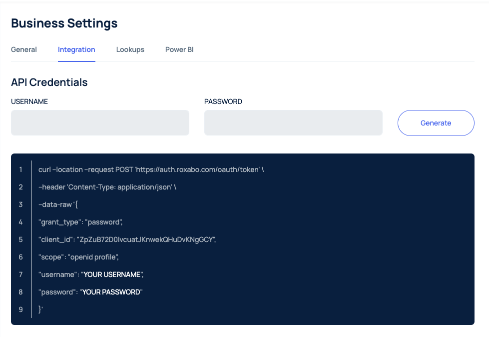

RoxForms has simple but yet powerfull API to manage forms. Together with simple CRUD opearions, RoxForms provides flexible Web Hook functionality. To be able to use REST API, users first need to obtain a JWT security token. 

## Generating Integration credentials 

Each tenant admin has ability generate a set of credentials to access API methods. Use Settings module to generate new pair of username & password:



> By licking **Generate** button, a new password will be created and previously used credentials will not be valid anymore. Please make sure you store credentials securely as they wont be shown again. 

## Obtaining a JWT security token

Roxabo platform has common api to get security tokens: https://auth.roxabo.com/oauth/token
To be able to obtain a new security token using previously generated username & password, users need to submit POST request:


```jsx
  POST https://auth.roxabo.com/oauth/token
  {
      "grant_type": "password",
      "client_id": "ZpZuB72D0IvcuatJKnwekQHuDvKNgGCY",
      "scope": "openid profile",
      "username": "{username}",
      "password": "{password}"
  }
```

API endpoint will return a payload which contains idToken and Access Token:

```jsx
{
    "access_token": "5kZuAS2sdfswGf8uNp363Y0NID4-AaZuz2e1",
    "id_token": "eyJhbGciOiJSUzI1NiIsInR5cCI6IkpXVCIsImtpZCI6I",
    "scope": "openid profile",
    "expires_in": 86400,
    "token_type": "Bearer"
}
```

To be able to send a request to the API, it is important to include id Token in the Authorization header. 

> Id Token has a limited lifetime. Please make sure you are checking if the token is valid before making a request to the API. To be able to check token claims, use publicly available libs: https://jwt.io/


## CREATE FORM

To create (submit) a new form, it is required to have following parameters: 
  - **templateFormId** - Template Id which will be used to submit a new form
  - **data** - Data object represents any values you would like to pass to newly created form 

```jsx
  POST https://api.roxabo.com/external-forms
  Authorization Bearer {idToken}
  {
      "data": {
          "control_1": {
              "state": "notApplicable",
              "value": "Test API"
          }
      },
      "templateFormId": "ulqhecWDkUeNx8KeuFnD"
  }
```
Where **control_1** - is a name for the control in the form. A new form will be submitted and a new created **formId** will be recived in the response payload:
```jsx
  {
    "formId":"69U8yrdjKCDZoQpy8xiD"
  }
```
